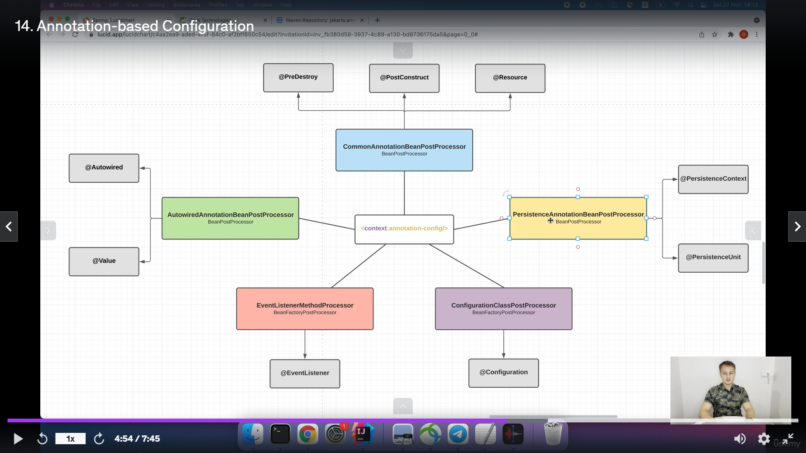
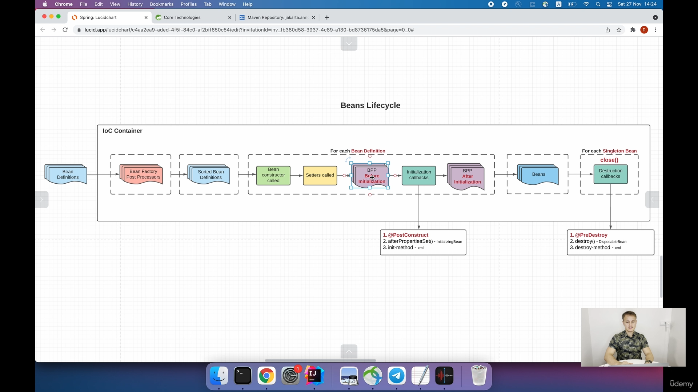
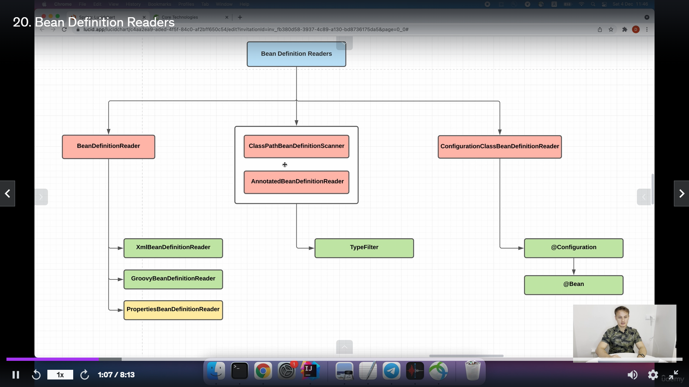

# Annotation config

<context:annotation-config/>

# Beans lifecycle

# Component Scan

<context:component-scan base-package="org.example"/> - также содержить те же xml файлы как Annotation config

# Bean definition reader 

